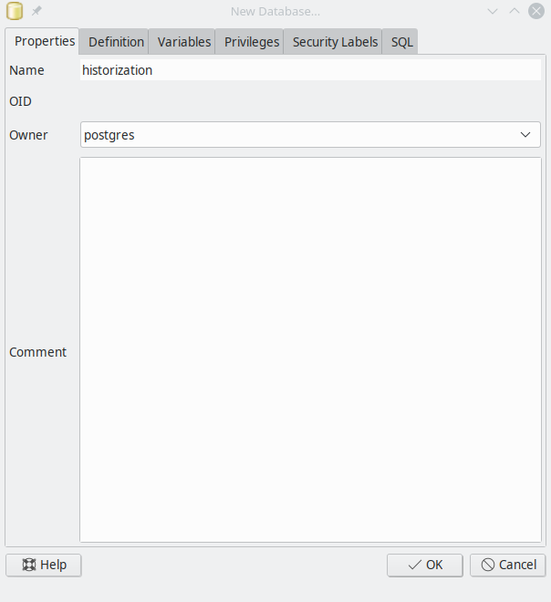

# PostGIS Versioning - pgVersion 3.5.2

### Dr. Horst Duester, 2025, horst.duester@sourcepole.ch

1.  [Administration](#toc1)
    *   [1.1 Installing the database](#toc11)
        *   [1.1.1 Login roles](#toc111)
        *   [1.1.2 Authentication to the database](#toc112)
        *   [1.1.3 Configuring the database](#toc113)
        *   [1.1.4 Enabling the PostGIS extension for the database](#toc114)
    *   [1.2 Installing the QGIS Plugin PgVersion](#toc12)
    *   [1.3 Installing PgVersion](#toc13)
        *   [1.3.1 Installing from the command line](#toc131)
        *   [1.3.2 Installation with the QGIS plugin](#toc132)
        *   [1.3.3 Rights management](#toc133)
2.  [PgVersion plugin functionality](#toc2)
    *   [2.1 Included database features](#toc21)
        *   [2.1.1 pgvsinit](#toc211)
        *   [2.1.2 pgvscommit](#toc212)
        *   [2.1.3 pgvsmerge](#toc213)
        *   [2.1.4 pgvsdrop](#toc214)
        *   [2.1.5 pgvsrevert](#toc215)
        *   [2.1.6 pgvsrevision](#toc216)
        *   [2.1.7 pgvslogview](#toc217)
        *   [2.1.8 pgvsrollback](#toc218)
3.  [Implementation as a PgVersion plugin in QGIS](#toc3)
    *   [3.1 Connecting to the database](#toc31)
    *   [3.2 Layer with the versioning system](#toc32)
    *   [3.3 Loading the versioned layer](#toc33)
    *   [3.4 Submit changes](#toc34)
    *   [3.5 Reset to HEAD revision](#toc35)
    *   [3.6 View differences](#toc36)
    *   [3.7 Logs show](#toc37)
    *   [3.8 Deleting selected objects directly in the database](#toc38)
    *   [3.9 Delete layer versioning](#toc39)
4.  [Practical tips:](#toc4)
    *   [4.1 Basic settings in QGIS](#toc41)
    *   [4.2 Historizing a layer with bigint data type of ID column](#toc42)
    *   [4.3 Adjusting existing object geometries of a layer](#toc43)
    *   [4.4 Customizing existing attributes of a layer](#toc44)
    *   [4.5 Add a new object to a layer](#toc45)
    *   [4.6 Delete objects in one layer](#toc46)
    *   [4.7 Discard recent changes](#toc47)
    *   [4.8 Go back to a previous revision of a layer](#toc48)
    *   [4.9 Remove a layer from versioning](#toc49)
    *   [4.10 Resolving a conflict while editing](#toc410)
    *   [4.11 Updating with copy/paste on the QGIS screen](#toc411)
    *   [4.12 NULL values ​​of primary-key column not allowed](#toc412)

# 1\. Administration

This section is about installing and administer the database in preparation for working with PGVersion.

## 1.1 Installation of the database

For example, assume that the database is named `historization` and is installed by the default administrator `postgres` on the server with the IP address `192.168.2.10` shall be.

<figure>

<figcaption>Figure 1: Create a new database with PgAdmin3.</figcaption>

</figure>

`createdb -U postgres -h 192.168.2.10 historization`

### 1.1.1 Login roles

For testing, two login roles (user1 and user2) are created for the database. This can be done either via the administration tool PgAdmin3\. For simplicity, username and password are the same.

Or run under Linux in bash.

`createuser -U postgres -h 192.168.2.10 -S -D -R -e user1 -W createuser -U postgres -h 192.168.2.10 -S -D -R -e user2 -W`

### 1.1.2 Authentication to the database

The configuration file for authentication pg_hba.conf must be adapted to the requirements of the user environment. Entries are added for valid IP address ranges and for authentication.

Further information can be found in the help of the PostgreSQL project: [https://www.postgresql.org/docs/9.6/static/auth-pg-hba-conf.html](https://www.postgresql.org/docs/9.6/static/auth-pg-hba-conf.html)

### 1.1.3 Configuration of the database

Now the adjustment PostgeSQL configuration file `postgresql.conf` is done. There are a variety of settings here. However, only the parameters `port` and `listen_addresses` are necessary for the beginning. These grant database access over the network. Therefore we change the following entry:

`listen_addresses = '*'  
port = 5432`

All other parameters we leave at this point as they are.

### 1.1.4 Enable the PostGIS extension for the database

In order to use spatial functionality in PostgreSQL, the database must be supplemented with the PostGIS extensions. This can either take place via the administration tool PgAdmin3 or run under Linux in bash.

<figure>

<figcaption>Figure 2: Install PostGIS extension.</figcaption>

</figure>

Extension to GIS functions after login to the database with the command: `psql -U postgres -h 192.168.2.10 historization`

`historization=# CREATE EXTENSION postgis;`

## 1.2 Installation of the QGIS plugin PgVersion

PgVersion is available as a plugin over the QGIS plugin repository it can be easily installed via the QGIS Plugin Manager.

After installation, it is in the working directory of the user.

under Linux:  
`/home/<user>/.local/share/QGIS/QGIS3/profiles/default/python/plugins/pgversion/`

under Windows:  
`C:\Users\<user>\AppData\Roaming\QGIS\QGIS3\profiles\default\python/plugins/pgversion/`

## 1.3 Installation of PgVersion

The extension of the database with the pgvs functions of PgVersion is usually started from a computer on which the corresponding QGIS plugin "pgversion" is installed. There is the possibility to install it via the command line or the plugin.

### 1.3.1 Installation via the command line

Change to the docs directory of the plugin.

under Linux:  
`/home/<user>/.local/share/QGIS/QGIS3/profiles/default/python/plugins/pgversion/docs/`

under Windows:  
C:\Users\<user>\AppData\Roaming\QGIS\QGIS3\profiles\default\python/plugins/pgversion/docs/

Run the following command from the command line `psql -U postgres -d historization -h 192.168.2.10 -f create_pgversion_schema.sql`

This creates a new schema `versions` in the `historization` database in which the new pgvs functions are stored.

The functions can basically also be executed directly on the database. This means that PgVersion can also be used without QGIS or the QGIS plugin.

Furthermore, a new group role `versions` is created. This already contains a number of rights so that login roles that are members of the group role `versions` can work with PgVersion.

### 1.3.2 Installation with the QGIS plugin

The other option is to perform the installation of the pgvs functions in QGIS via the loaded plugin. If you have imported some layers into the new database and want to start the history of the first layer, click on the icon. Then comes the message.

<figure>

<figcaption>Figure 4: pgvs is not installed.</figcaption>

</figure>

Now click on the Install pgvs icon to install the versioning. Then a success message should appear.

<figure>

<figcaption>Figure 5: The installation of pgvs was successful.</figcaption>

</figure>

### 1.3.3 Rights management

Before starting to version the first layers, a few `DEFAULT PRIVILEGES` should be added. For this, e.g. again PgAdmin3, the QGIS DB Manager or the command line are used. Depending on requirements, the rights can be adjusted - here is an example:

Roles `user1` and `user2` become members of the group role versions`  
GRANT versions TO user1;  
GRANT versions TO user2;`

Allow default access to future tables`  
ALTER DEFAULT PRIVILEGES IN SCHEMA public, versions GRANT ALL ON TABLES TO versions;`

Default rights to functions in schema versions`  
ALTER DEFAULT PRIVILEGES IN SCHEMA versions, public GRANT EXECUTE ON FUNCTIONS TO versions;`

Default rights to sequences in schemas versions and public`  
ALTER DEFAULT PRIVILEGES IN SCHEMA versions, public GRANT USAGE, SELECT ON SEQUENCES TO versions;`

If a table has already been versioned before, corresponding rights can also be given later. The rights specified here can be adjusted as needed.

Allow access to existing tables`  
GRANT ALL ON ALL TABLES IN SCHEMA public, versions TO versions;`

Give rights to all sequences in scheme public and versions`  
GRANT USAGE, SELECT ON ALL SEQUENCES IN SCHEMA versions, public TO versions;`

Give rights to all functions in schemas publich and versions`  
GRANT EXECUTE ON ALL FUNCTIONS IN SCHEMA versions, public TO versions;`

# 2\. Functionality of the PgVersion plugin

After the database `historization` with the schema `versions` and the users `user1` and `user2` has been created, you can use the pgvs functions be used on the PgVersion Pugin.

After installing and activating the plugin, the functionality can be accessed via icons in the toolbar of QGIS:

<figure>

<figcaption>Figure 7: PgVersion toolbar.</figcaption>

</figure>

Furthermore there is the menu entry "Database" → "PG Version":

<figure>

<figcaption>Figure 7: PG Version integration in QGIS Menu.</figcaption>

   
### 2.1 Included database functions

The schema `versions` created at initialization contains all the information needed to manage the versioned tables. Be careful not to make any changes in the `versions` schema. This is reserved for the pgvs functions alone.

Incidentally, you also have the option to install the pgvs environment in the `template1` database of the PostgreSQL server. In this case, any newly created database will automatically contain the pgvs environment.

### 2.1.1 pgvsinit

The pgvsinit() function initializes the versioning environment for a single layer. The init command is:

`select * from versions.pgvsinit('<schema>.<table_name>');`

**The initialization works in 3 steps:**

*   A view with the name `<table_name>_version` is created. This has the same structure as the original table.
*   It will create some rules and triggers for the new view.
*   It will be a meta-table record `versions.version_tables` added.

Any future changes you make will be reflected on the view `<table_name>`_version instead of. If you want to change the geometry or attribute value of a versioned PostGIS layer, you can do so in the same way you edit a real table.

After the changes have been saved for the layer, they will be visible - but only for you. For this they are stored in a temporary state, as a memory layer. To make the changes visible to the rest of the world, you must commit your changes to the database.

It is not possible to change the structure of the underlying table. If you want to do this, you must delete the versioning system from the table, as described later. Then you can make your changes. Then you have to initialize the versioning system for the table again.

### 2.1.2 pgvscommit

After a while, when your changes are complete, you must commit them to the Master PostGIS table. This will make your changes available to other users.

The commit command is:

`select * from versions.psvscommit('<schema>.<table_name>', '<_log-message_>');`

Sometimes it happens that two or more users are working on the same table object. In this case, the pgvscommit () function lists the conflicting records. The conflict objects are not stored in the database. In this case, please contact the other user in the error message to discuss which change should be applied to the database.

### 2.1.3 pgvsmerge

In order to solve conflicts the command serves:

`select * from versions.pgvsmerge('<schema>.<table_name>',<record-id>,'<userrname>');`

### 2.1.4 pgvsdrop

To remove the versioning for a specific table, use the command: `select * from versions.pgvsdrop('<table_name>');`

This removes all versioning entries from the PostGIS table. You can only delete the versioning of a table if all changes are committed by all users.

You do not have to worry about that, because the command `pgvsdrop('<table_name>');` only removes the versioning system. Of course, the Master PostGIS table with all former changes (committs) still exists.

### 2.1.5 pgvsrevert

The pgvsrevert function offers the possibility to remove all not yet committed changes and to return your data to the HEAD revision. The revision number of the HEAD revision is returned.

`select * from versions.pgvsrevert('<table_name>');`

### 2.1.6 pgvsrevision

The pgvsrevision function returns the installed revision of pgvs.

`select * from versions.pgvsrevision();`

### 2.1.7 pgvslogview

The pgvslogview function returns all the logs of a specific, versioned table:

`select * from versions.pgpslogview ('<table_name>');`

### 2.1.8 pgvsrollback

The pgvsrollback function returns a revision to the HEAD revision:

`select * from versions.pgvsrollback('<table_name>', revision integer);`

This feature works reliably from the pgvs db version 1.8.4 and the QGIS plugin version 2.0.2\. If there are previous revisions of a layer, they are not ready for rollback.

# 3\. Implementation as PgVersion plugin in QGIS

To make it easier to work with the pgvs functions, they are implemented as QGIS Plugin PgVersion for QGIS 3.x and PostGIS 2.x. The available functionality includes the following steps:

## 3.1 Connection to the database

Start QGIS and create a connection to the database `historization` via "Add PostGIS Layer". Now load a layer you want to provide for versioning, e.g. from the public schema, into your QGIS project.

## 3.2 Layer provided with the versioning system 

This option starts the versioning for a PostGIS layer. You have to do this once for each layer to be integrated into the versioning. Select the layer in the layer window and click on the icon "Prepare the layer for versioning" and the versioning system will be initialized for it.

<figure>

<figcaption>Figure 8: Create the version environment.</figcaption>

</figure>

After confirming this step, another window opens, confirming the initialization and informing you to adjust the user rights for the view if required and the layer for further editing via the functionality of the QGIS pgversion plugin "Loading the versioned layer" to load.

<figure>

<figcaption>Figure 9: The initialization was successful!</figcaption>

</figure>

Confirm this message by clicking OK. The layer is now removed from the layer window. The rights described in Chapter 1 have been assigned to the newly versioned layer as DEFAULT PRIVILEGES via the group role versions.

To work with the versioned layer you have to load it again via the plugin tools. Depending on the rights, each user can version tables. However, we recommend leaving this to the administration of the database.

## 3.3 Loading the versioned layer 

Now you can load the corresponding view with the icon "Load the versioned layer".

<figure>

<figcaption>Figure 10: PostGIS versioning system.</figcaption>

</figure>

Choose your database connection. You will then see the connected users and can select the versioned layer from a list, load it into QGIS and start editing. If a versioned layer is already loaded in QGIS, you will be notified accordingly.

## 3.4 Commit changes 

When you have finished editing, you can commit your changes to the database. Save the changes first. The layer is then supplemented in the layer window with a (modified) note.

Now click on the icon "Transfer changes". If no conflicts between your changes and another user's changes have been detected for the edited objects, a dialog opens in which you must enter a log message.

<figure>

<figcaption>Figure 11: Change description.</figcaption>

</figure>

If you do not enter a message, the last commit message below will be used. It is therefore not possible to commit without a commit message. Confirm this dialog with OK. With the icon "Show Logs" you can see the log information of the last commits.

In the event that another user has changed one or more objects that you have also edited, a new window will open, showing the conflicts with the other changes and giving you the option of choosing one version or the other.

<table>

<tbody>

<tr>

<td>

<figure>

<figcaption>Figure 12: Adjustments User 1.</figcaption>

</figure>

</td>

<td>

<figure>

<figcaption>Figure 13: Adjustments User 2.</figcaption>

</figure>

</td>

</tr>

</tbody>

</table>

To mark the conflict variants of the users of an object from the table below the map, select the line and thus the object variant of a user. This is then highlighted in blue.

<figure>

<figcaption>Figure 14: Candidate list in case of conflict.</figcaption>

</figure>

You have two options for resolving conflicts.

*   You can process the "conflict" candidates one after the other and decide individually which candidate should be accepted.
*   You choose to accept all commits of a user.

## 3.5 Reset to the HEAD revision 

If you want to remove a saved but not yet committed change, it means that you need to move the view back to the HEAD revision, which is the version you checked out at the beginning of the work.

In this case, any changes that have been made so far will be removed. To use this feature, select the appropriate layer and click the "Reset to HEAD Revision" icon.

## 3.6 Show differences 

<figure>

<figcaption>Figure 15: Difference local adaptation and HEAD of the database.</figcaption>

</figure>

If you want to compare a saved, but not yet made change with the current HEAD revision in the database, you can do this with the icon "Differences to HEAD Revision" - see also chapter 3.7.

A difference layer is created for the selected map section, which shows you with a green line which geometries have been added and with a red line which geometries have been removed. The difference layers are memory layers and can be easily deleted from the layer window when you no longer need them.

If you want to compare the changes in the attribute table, you can also do so by clicking the object with the QGIS Query Objects tool and Top to Bottom mode. Then the query results display the attributes for visual comparison.

## 3.7 Show logs 

The Logview dialog gives you the opportunity to get an overview of the changes of a single layer. You will also be able to return to a specific revision or marker. The rollback is then loaded into QGIS and displayed.

<figure>

<figcaption>Figure 16: Show and display revision logs.</figcaption>

</figure>

Possible approaches are:

*   You select a revision and then click on the "Check out selected revision" button to display it in QGIS.
*   If you want to compare a saved but not yet committed change with the current HEAD revision in the database - see also chapter 3.6, you can do this with the icon "Differences to HEAD Revision".
*   You select a revision and then click the "Reset to the selected revision" button to make it the current version (HEAD). Previously created revisions are retained.
*   You select a revision and click the right mouse button to mark the revision and save it as a "tag". In the picture as example "Completion phase 1 on 28.3.2017". These can now be selected, checked out and viewed in QGIS.

<figure>

<figcaption>Figure 17: Set tags.</figcaption>

</figure>

## 3.8 Delete selected objects directly in the database 

This functionality allows objects of a versioned layer previously selected in QGIS to be deleted directly on the database. QGIS 'own function for deleting selected objects turned out to be very slow, so this functionality was additionally integrated at this point. However, it can only be used if the user has the appropriate rights in the database.

<figure>

<figcaption>Figure 18: Delete directly in the database.</figcaption>

</figure>

## 3.9 Delete versioning of the level 

Like the direct deletion in the database, this functionality is not directly accessible from the toolbar. Deleting the versioning of a layer does not delete the layer itself.

It is "only" about the versioning environment of the layer. This is necessary the moment you want to change the model of the layers, e.g. add a new attribute column or no longer want to use versioning for the layer.

Activate the corresponding layer and click on "Delete layer versioning" in the menu.

# 4\. Tips for the practice

At this point, practical tips to get started in working with the plugin to be facilitated. We assume that the corresponding layers are already historicized.

## 4.1 Basic settings in QGIS

*   Under Settings → Options → Data sources, set the following:
    *   Attribute Table Behavior = Show Visible Objects of the Map
    *   Attribute table row cache = ~ 200000 (depending on the maximum number of objects in your layers)
*   In the Settings → Options → Appearance menu, set the following:
    *   Uncheck "Normally, all new layers are displayed"
    *   Activate "Use presentation cache"
    *   Check "Draw parallel layers with many CPU cores" and specify a maximum number of cores to use.
*   In the menu, select Settings → Options → Digitization:
    *   Check "Show Snap Options Dialog in a Dock Window". After a one-time QGIS reboot, you can then set the capture mode in the dock window and also specify whether topological functionality should be used when digitizing.

## 4.2 Historization of a layer with bigint data type of the ID column

For some data, the ID column is created in the attribute table as a "bigint" or "integer64" data type. When importing these layers to PostGIS, the data type is not automatically converted to "bigserial". However, this is necessary for the versioning, where the column by default acts as a "Primary-Key" column. Therefore, after the import and before the versioning, the conversion from the bigint to the bigserial data type must be done manually, see example for the layer `bauleitplanung_nds`.

First, the following value is determined for the existing data record for the column `id`:

`SELECT MAX(id)+1 FROM "bauleitplanung_nds";`

The result (for example: 44151) is then used to create a sequence and assign it to the id column so that it is converted into the serial data type. The following additional steps are necessary for this:

`CREATE SEQUENCE bauleitplanung_nds_id_seq start with 44151 owned by "bauleitplanung_nds"."id";`

`ALTER TABLE bauleitplanung_nds ALTER COLUMN id SET DEFAULT nextval('bauleitplanung_nds_id_seq');`

`ALTER SEQUENCE bauleitplanung_nds_id_seq OWNED BY "bauleitplanung_nds"."id";`

The PgVersion plugin checks when initializing a new layer whether the PrimaryKey data type is "serial" or "bigserial". If this is not the case, the process is aborted with an error.

<figure>

<figcaption>Figure 19: Error with missing serial data type.</figcaption>

</figure>

## 4.3 Customize existing object geometries of a layer

*   Load the historized layer `grenzen_bkg` via the pgversion plugin and the WMS service WebAtlasde via the tool Add WMS layer.
*   Activate the edit mode of the layer `borders_bkg`, zoom in on an area and flatten the vertices of a line.
*   Save the change in QGIS. The modified layer now gets the addition (modified). The change has not yet been returned to the historization.
*   Take a look at the difference between the two versions by clicking the PgVersion Show Differences tool. You can now see in red which line area is removed and in green which line area has been added.
*   Select the pgversion tool "Pass change" and enter a change description in the Commit window, e.g. "Line course adjusted". Then click OK". The addition (modified) disappears again.
*   You can understand this first change by clicking on the "Show Logs" PgVersion tool.

## 4.4 Customize existing attributes of a layer

*   Load the historized layer `grenzen_bkg` via the PgVersion plugin.
*   Activate the editing mode of the layer `borders_bkg`, open the layer's attribute table and write something in the column "notice".
*   Save the change in QGIS. The modified layer now gets the addition (modified). The change has not yet been returned to the historization.
*   Take a look at the difference between the two versions by clicking the PgVersion Show Differences tool. If you then select both versions and compare them using a query in the Layer Selection mode, you can understand the changes.
*   Next, select the PgVersion "Submit Change" tool and enter a change description in the Commit window, e.g. Note entry in column. Then click OK". The addition (modified) disappears again.
*   You can understand this change by clicking on the "Show Logs" PgVersion tool.

## 4.5 Add a new object to a layer

*   Load the historized layer `grenzen_bkg` via the PgVersion plugin.
*   Activate the editing mode of the layer `borders_bkg`, zoom into an area and add a new borderline anywhere.
*   Save the change in QGIS. The modified layer now gets the addition (modified). The change has not yet been returned to the historization.
*   Take a look at the difference between the two versions by clicking the PgVersion Show Differences tool. If you then select both versions and compare them using a query in the Layer Selection mode, you can understand the changes.
*   Next, select the PgVersion "Submit Change" tool and enter a change description in the Commit window, e.g. "Added new border". Then click OK". The addition (modified) disappears again.
*   You can understand this change by clicking on the "Show Logs" PgVersion tool.

## 4.6 Delete objects in a layer

*   Deleting objects in a layer Load the historicized layer `windenergie` via the pgversion plugin.
*   Activate the edit mode of the layer `windenergie`, zoom to the area in the middle of the North Sea, mark it and then delete. You have two options:
    *   They can remove the surface via the QGIS tool "Delete Selected".
    *   You can use the PgVersion tool "Delete directly in the database".The latter is always the better option when dealing with large amounts of data. Otherwise, this can take a long time with the QGIS tool.
*   Save the change in QGIS. The modified layer now gets the addition (modified). The change has not yet been returned to the historization.
*   Now click on the PgVersion tool "Reset to Head Revision". As a result, your changes are lost, they are discarded.

## 4.7 Discard recent changes

*   Load the historized layer `grenzen_bkg` via the PgVersion plugin.
*   Activate the editing mode of the layer `borders_bkg`, zoom in on an area and move the vertices of a line.
*   Save the change in QGIS. The modified layer now gets the addition (modified). The change is not yet returned to the versioning.
*   Select the PgVersion "Submit Change" tool and enter a change description in the Commit window, e.g. "Area deleted". Then click OK". The addition (modified) disappears again.
*   You can understand this first change by clicking on the "Show Logs" PgVersion tool.

## 4.8 Go back to a previous revision of a layer

*   Load the historized layer `grenzen_bkg` via the PgVersion plugin.
*   Click the PgVersion Show Logs tool, and then select a revision to which you want to reset the layer.
*   Now click on the button "Reset to the selected revision". The previous steps are still historicized. However, you have reset the state of the layer to the status of the selected revision.

## 4.9 Remove a layer from versioning

*   Download the historicized polygon layer navigation via the PgVersion plugin.
*   Select the layer and go to the menu Database → PgVersion.
*   There you can remove the layer from the versioning with the tool "`Delete Versioning of the Layer`".
*   Please remember, this step is irrevocable!

## 4.10 Resolve a conflict while editing

*   Load the historized polygon layer `navigation` via the PgVersion plugin.
*   Select the layer, make a change to a polygon, and save it locally without committing it.
*   Now load the historized polygon layer `navigation` via the PgVersion plugin as another user. Make a change to the same polygon and commit it back to the versioning.
*   Then switch back to the 1 user and try to commit your change as well.
*   A window will now open, allowing you to solve the conflict together with the other user.

## 4.11 Update with copy / paste on the QGIS screen

*   Download the versioned record rail_version
*   Download the continuation Entwurf_LROP_2014_Schiene.shp
*   Bring both layers into edit mode and then copy / paste the versioned dataset with the geometries and attributes from the continuation.

## 4.12 NULL values of the primary-key column not allowed

QGIS recognizes the presence of a Primary-Key column during editing and does not allow it to be saved without entering a value.

<figure>

<figcaption>Figure 20: Saving a value with a primary key NULL.</figcaption>

</figure>

There are 2 ways to handle it.

*   You can always enter any value. This will be overwritten when passing the changes to the versioning.
*   Once after the initial versioning of a layer, you define this in the Layer properties menu → Attribute form for the "ID" column in the Set control element type area, that this will become a hiding place. Then save the style as default in the database, so that it is always used automatically for each user.

<figure>

<figcaption>Figure 21: Save the style in the database.</figcaption>

</figure>

</figure>
